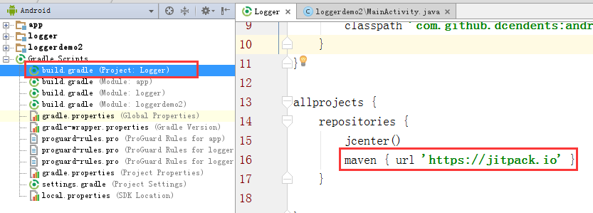

# orhanobut logger项目使用
---
开源地址：[https://github.com/open-android/Logger](https://github.com/open-android/Logger "https://github.com/open-android/Logger")

# 运行效果

## 使用步骤

### 1. 在project的build.gradle添加如下代码(如下图)

	allprojects {
	    repositories {
	        maven { url "https://jitpack.io" }
	    }
	}

### 2. 在Module的build.gradle添加依赖

    compile 'com.github.open-android:Logger:v1.0.0'

### 3.调用Logger功能

	Logger.d("打印logger信息");//输入结果如第一张 运行效果图

	

	
